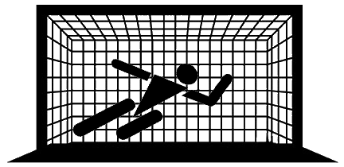

# @xoi/serverless-log-keeper



**Serverless Framework plugin that adds a deletion retain policy on aws lambda logs**


[](https://github.com/xoeye/serverless-log-keeper/actions/workflows/unit-test.yml)
[](https://codecov.io/gh/xoeye/serverless-log-keeper)

## Usage

1. To use this serverless plugin, you must first install it as a dependency.

   Run `npm install --save-dev @xoi/serverless-log-keeper` or `yarn add --dev @xoi/serverless-log-keeper`

3. Add the plugin to your `serverless.yml` and add its configuration properties

   ```yaml
   [...]
   region: us-east-2

   plugins:
     - '@xoi/serverless-log-keeper'

   logkeeper:
     keepLambdaLogs: true
   [...]
   ```

4. Continue using Serverless as you normally would!
   Logkeeper will automatically add a deletion policy of retain to each /aws/lambda LogGroup

## Configuration

All configuration is done in serverless.yml at the root level under the `logkeeper` property.

Here are the possible configuration options:
| Configuration Key | Required? | Default | Description |
| ----------------- | --------- | ------- | ------------|
| keepLambdaLogs | Yes | N/A | A boolean that determines if we're going to retain lambda logs or not |

## Contributing

We welcome all contributors with open arms! See [CONTRIBUTING.md](./CONTRIBUTING.md)
